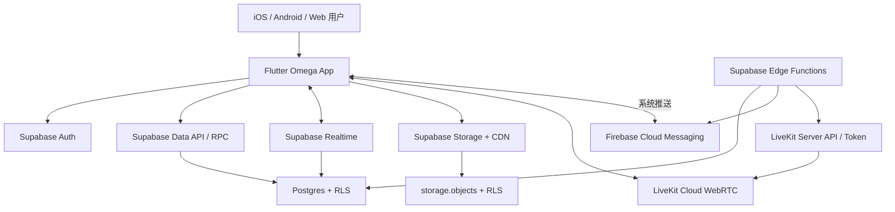
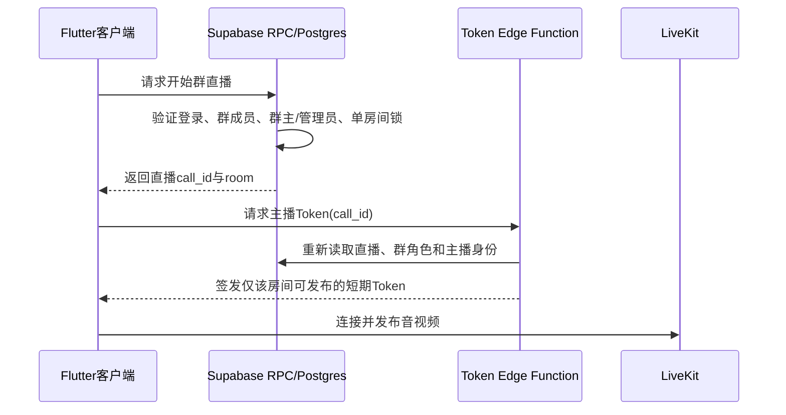
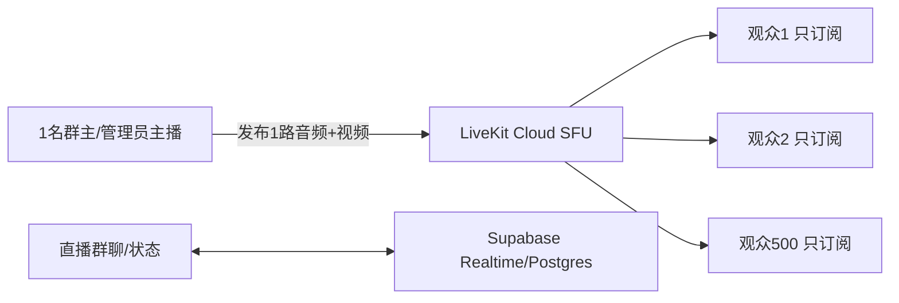

# Omega App 完整架构

> 文档性质：基于现有 `social_app` 代码的目标架构与补强方案  
> 目标容量：App 500 人同时在线；单场直播 500 人同时观看  
> 客户端：Flutter（iOS、Android、Web）  
> 更新日期：2026-07-11

## 1. 架构结论

Omega App 不需要推倒重做。现有的 **Flutter + Supabase + Firebase Cloud Messaging + LiveKit** 组合可以继续使用，并足以支撑第一阶段的 500 人并发目标，但必须完成以下补强：

1. Supabase 至少使用 Pro 级生产项目，并为 Realtime 留出高于 500 的连接余量；不能把“500人在线”直接按套餐标称的 500 个连接刚好配置。
2. 单场 500 人直播继续由 LiveKit 承担，采用“1名主播发布、观众只订阅”的模式；LiveKit 免费 Build 方案仅支持 100 名并发参与者，不能用于该目标，需使用支持 500+ 并发的付费方案并提前申请/确认额度。
3. 群主和群管理员的开播权必须由数据库函数与 LiveKit Token 签发服务双重校验，不能只依靠 Flutter 界面隐藏按钮。
4. 聊天、通知、群状态和直播状态继续走 Supabase Realtime；视频、音频、图片和文件只存对象存储，数据库只保存地址和元数据。
5. 经书正文采用本地缓存优先、按章读取、按需同步，避免500人同时进入读经页时重复读取相同内容。
6. 所有高频列表必须使用游标分页、复合索引、缓存与断线补拉；禁止一次加载全部帖子、消息、成员或章节。
7. 上线前必须用独立测试环境完成 500 在线用户与 500 直播观众的容量测试，套餐名称不能代替实测。

## 2. 范围与边界

### 2.1 本期包含

- 注册、登录、会话保持和账号安全
- 广场发帖、浏览、评论、点赞、收藏、关注
- 经书目录、章节阅读、搜索、书签、章节笔记、逐节笔记、离线缓存
- 一对一私聊、群聊、消息已读、文件与媒体消息、推送通知
- 一对一语音/视频通话
- 群直播：仅群主和群管理员开播，群成员观看
- 拉黑、举报和基础内容过滤
- 500人同时在线及单场500观众的容量设计
- 监控、备份、容灾、发布与验收标准

### 2.2 本期不包含

- 独立运营管理后台
- 普通成员开播
- 多主播连麦、观众上麦和大型公开直播广场
- 直播录制、回放、转推 RTMP/HLS（可作为后续阶段）
- 复杂推荐算法、广告系统、付费订阅系统

## 3. 现有技术基线

| 层级 | 当前实现 | 继续保留 | 主要补强 |
|---|---|---:|---|
| 客户端 | Flutter | 是 | 分层、统一状态管理、断线恢复、性能监控 |
| 路由 | go_router | 是 | 登录守卫、深链、推送跳转一致性 |
| 状态管理 | Riverpod | 是 | 按领域拆分状态，避免页面直接承担数据同步 |
| 身份与数据库 | Supabase Auth + Postgres | 是 | RLS审计、服务端授权、索引、容量监控 |
| 实时数据 | Supabase Realtime | 是 | 合并频道、减少订阅、断线补拉、额度余量 |
| 文件 | Supabase Storage `media` | 是 | 私有/公开桶拆分、限型限大小、断点续传、CDN |
| 推送 | Firebase Cloud Messaging | 是 | 幂等、失败重试、无效Token清理、通知偏好 |
| 通话/直播 | LiveKit | 是 | 付费容量、服务端Token权限、弱网策略、压测 |
| 服务端逻辑 | Supabase Edge Functions + Postgres RPC | 是 | 函数版本入库、鉴权、限流、可观测性 |
| 本地缓存 | SharedPreferences/本地缓存服务 | 部分保留 | 经书与消息改为结构化本地数据库更稳妥 |

当前代码中已经存在的主要领域：

- 广场：`PostService`、Feed、帖子详情、评论、点赞、收藏、关注流。
- 经书：经书列表、章节阅读、搜索、交叉引用、书签、章节/逐节笔记、章节下载。
- 私聊与群聊：会话、成员角色、文字/图片/语音/视频/文件/经文消息、编辑、撤回、已读。
- 通话与直播：`CallService`、`ActiveMediaSession`、LiveKit 房间、直播心跳与单房间约束。
- 安全：拉黑、举报、RLS补强、推送通知。

## 4. 总体架构

### 4.1 职责划分

- **Flutter客户端**：页面展示、本地缓存、上传、实时订阅、断线恢复、LiveKit媒体收发。客户端不拥有最终授权权力。
- **Postgres/RLS/RPC**：业务事实与最终权限，包括群成员关系、群角色、帖子、消息、已读点、通话和直播状态。
- **Edge Functions**：需要密钥或跨服务调用的逻辑，包括LiveKit Token签发、FCM推送、敏感操作限流。
- **Realtime**：通知客户端“数据变了”，不代替数据库；漏事件后通过REST/RPC补拉恢复。
- **Storage/CDN**：保存图片、视频、语音和文件；Postgres仅存路径、类型、大小、时长等元数据。
- **LiveKit**：唯一负责语音、视频和直播媒体流；Supabase只保存房间业务状态，不转发媒体。

## 5. 功能域设计

### 5.1 账号与个人资料

核心表：`auth.users`、`profiles`、`push_tokens`、`blocks`、`reports`。

设计要求：

- 登录由Supabase Auth负责，客户端只保存SDK管理的会话。
- `profiles.id = auth.users.id`；公开资料与私密资料分离，避免电话、邮箱等敏感字段出现在公开查询中。
- 角色或授权信息不得放在用户可编辑的 `user_metadata` 中；若未来需要平台管理员角色，应存入不可由用户编辑的服务端数据或 `app_metadata`。
- Push Token按“用户 + 设备 + 平台”记录，支持一人多设备；注销、失效或FCM返回无效时清理。
- 拉黑规则在客户端用于即时提示，在数据库RLS/RPC中做最终限制。
- 删除账号应处理帖子归属、消息保留策略、Storage对象和Push Token，并建立可追踪的异步清理流程。

### 5.2 广场发帖

核心表：`posts`、`post_comments`、`post_likes`、`post_bookmarks`、`follows`、`notifications`。

#### 写入流程

1. 客户端压缩图片/视频并检查类型与大小。
2. 媒体上传至Storage，以 `posts/{user_id}/{post_id}/...` 组织路径。
3. 上传成功后创建帖子记录；失败时不创建半成品帖子。
4. 后台清理“已上传但未绑定帖子”的孤儿文件。
5. 点赞、收藏使用唯一约束 `(user_id, post_id)` 保证幂等；计数由可靠触发器或聚合查询维护。

#### 读取流程

- 推荐/最新/关注三个Feed均使用20条左右一页的游标分页。
- 排序游标使用 `(created_at, id)`，不使用深页码 `offset`。
- 列表查询一次带回作者摘要、点赞数、评论数和当前用户状态，避免每张卡片额外查询。
- 图片通过CDN加载缩略图；视频列表默认不自动加载原文件，先显示封面。
- 热门排序结果可按分钟级缓存，不对每次请求实时全表计算。

#### 建议索引

- `posts(status, created_at desc, id desc)`
- `posts(author_id, created_at desc, id desc)`
- `post_comments(post_id, created_at, id)`
- `post_likes(post_id, user_id)` 唯一
- `post_bookmarks(user_id, created_at desc, post_id)`
- `follows(follower_id, following_id)` 唯一

### 5.3 读经书

核心表：`scriptures`、`scripture_chapters`、`scripture_cross_references`、`bookmarks`、`reading_notes`。

#### 内容与用户数据分离

- 公共内容：经书元数据、章节正文、交叉引用。
- 私人数据：书签、章节笔记、逐节笔记、阅读位置。
- 公共经文内容只读；只有服务端发布流程可以写入。
- 笔记与书签必须以 `user_id = auth.uid()` 做RLS隔离。

#### 性能策略

- 经书目录启动后本地缓存；章节正文按章下载并持久化。
- 进入章节先显示缓存，再在后台检查版本号；正文未变则不重复下载。
- 章节接口返回内容版本/更新时间，用于增量同步。
- 搜索短期可继续使用Postgres全文检索或现有搜索；500在线规模不需要单独搜索服务。
- 高频章节可由CDN或边缘缓存承载，但用户笔记绝不能进入公共缓存。
- 下载整本经书时分批串行，允许暂停、恢复和校验，不并发轰击数据库。

### 5.4 私聊与群聊

核心表：`conversations`、`conversation_members`、`messages`、`group_folders`、`group_file_folders`。

#### 会话模型

- 私聊会话：固定两名成员；服务端函数保证同一对用户只有一个有效私聊。
- 群聊会话：一个创建者（群主）和多名成员；成员角色至少为 `member`、`admin`，群主以 `conversations.created_by` 为准。
- 成员离群采用隐藏/退出时间等可审计状态优于直接删除；若继续物理删除，必须明确历史消息是否可见。
- 所有会话读取、消息读取和写入均必须验证当前用户是该会话成员。

#### 消息模型

- 通用字段：`id`、`conversation_id`、`sender_id`、`message_type`、`content`、`payload`、`created_at`、`edited_at`、`is_deleted`。
- 媒体只在 `payload` 或专用字段记录Storage路径、MIME、大小、宽高、时长和缩略图。
- 客户端生成 `client_message_id`，服务端设唯一约束，网络重试不会产生重复消息。
- 消息按 `(conversation_id, created_at desc, id desc)` 游标分页。
- 已读使用成员表的 `last_read_at` 或最后已读消息ID，不为每条消息生成“每人已读行”。

#### 实时与断线恢复

1. 打开会话时先从本地缓存显示最近消息。
2. 按游标从数据库补拉缓存之后的新消息。
3. 再订阅该会话的新消息和更新事件。
4. Realtime断线重连后，以最后收到的 `(created_at, id)` 再补拉，不能假设所有事件都收到。
5. App前台只保留必要频道；离开页面及时取消页面级频道。
6. 会话列表尽量使用一个用户级同步机制，避免每个群都独立建立多个频道。

#### 500人群的消息风暴控制

- 每位用户每秒发送消息数设置服务端限制。
- 同一群短时间大量消息时，客户端合并刷新与已读上报。
- `last_read_at` 更新节流，例如离开页面、停顿或每数秒更新一次，而非每收到一条就写库。
- 推送只发给离线/后台成员；前台正在查看该会话时不重复发系统推送。
- 群通知批量化，Edge Function不要对500名成员串行逐个请求。

### 5.5 私聊语音/视频通话

#### 信令与媒体

- Supabase `calls` 表保存 `ringing / accepted / declined / ended / missed` 状态。
- FCM负责后台/锁屏来电提醒，Realtime负责前台快速状态更新。
- LiveKit承载媒体，房间名必须不可猜测或至少不具备授权意义；真正权限取决于服务端签发的短期Token。
- Token应限制房间、用户身份、是否发布、是否订阅，并设置短有效期。
- 接听/挂断等状态变更必须限定为主叫或被叫本人。
- 拉黑关系由数据库与Token服务同时检查。

#### 弱网与生命周期

- 前后台切换、网络变化、蓝牙/听筒切换均应有明确状态机。
- Realtime信令丢失时，回前台主动查询仍在振铃或已接通的通话。
- 通话结束由服务端或客户端幂等写入，重复挂断不报错。
- 记录通话类型、发起者、开始/结束时间和结果，不记录媒体内容。

### 5.6 群直播

#### 业务规则

- 只有群主 `conversations.created_by` 和 `conversation_members.role = 'admin'` 可以开播。
- 只有当前群成员可以获取该群直播的观看Token。
- 主播获得 `canPublish=true, canSubscribe=true`。
- 普通观众获得 `canPublish=false, canSubscribe=true`。
- 每个群同一时间只允许一个有效直播房间。
- 群主和管理员可结束直播；主播掉线超过心跳窗口后直播自动标记失效。

#### 必须采用的双重服务端授权

禁止以下做法：

- 只在Flutter里隐藏“开直播”按钮。
- Token函数直接相信客户端传来的 `can_publish`。
- 普通群成员可以任意指定 `identity` 冒充他人。
- 以房间名是否保密作为访问控制。

#### 现有实现的明确缺口

- 当前 `start_livestream_call` RPC对 `authenticated` 开放，但函数体没有验证调用者是不是该群的群主或管理员。目标架构中必须补上角色校验。
- 当前客户端向Token函数提交 `can_publish` 和可选 `identity`。目标架构要求Token函数忽略客户端自报权限，以当前JWT用户和数据库角色重新计算。
- `livekit-token` Edge Function未出现在当前仓库的 `supabase/functions` 目录中。生产架构要求将其源码、配置和部署说明纳入版本管理。
- 当前心跳已限制为直播发起者更新，这是正确方向；仍需为异常断线建立定时清理或查询时判死机制。

#### 500观众媒体拓扑

- 观众不发布轨道，减少上行和房间复杂度。
- 主播建议发送多档编码（simulcast）；观众启用自适应流，根据网络和画面尺寸选择质量。
- 移动端默认720p或更低，并提供纯音频/低清模式。
- 直播聊天继续走Supabase，不使用LiveKit数据包保存永久聊天记录。
- 500名观众均属于LiveKit并发参与者；Build免费方案默认仅100人，必须升级并在发布前确认项目并发额度。
- 500人同时以1 Mbps观看，一小时理论下行约为225 GB（未计协议开销与自适应降码率），成本评估必须以参与者分钟和下行流量为核心。

## 6. 数据库与权限架构

### 6.1 RLS总原则

- `public` 暴露Schema中的每张表均开启RLS。
- 策略不仅写 `TO authenticated`，还必须验证所有权、成员关系或公开状态。
- `UPDATE` 同时具有 `USING` 和 `WITH CHECK`，防止改写归属字段。
- View使用 `security_invoker`，或撤销客户端访问。
- `SECURITY DEFINER` 仅在确有必要时使用，放在非暴露Schema，固定空或最小 `search_path`，撤销 `PUBLIC` 执行权并在函数体再次验证 `auth.uid()`。
- Storage RLS与业务表RLS一致；知道文件路径不等于有读取权限。

### 6.2 关键授权矩阵

| 操作 | 游客 | 登录用户 | 群成员 | 群管理员 | 群主 |
|---|---:|---:|---:|---:|---:|
| 浏览公开帖子/经书 | 按产品策略 | 是 | 是 | 是 | 是 |
| 发帖/评论/点赞 | 否 | 是 | 是 | 是 | 是 |
| 读本人笔记/书签 | 否 | 仅本人 | 仅本人 | 仅本人 | 仅本人 |
| 读群消息 | 否 | 否 | 是 | 是 | 是 |
| 发群消息 | 否 | 否 | 是 | 是 | 是 |
| 增删群成员 | 否 | 否 | 否 | 按规则 | 是 |
| 开始直播 | 否 | 否 | 否 | 是 | 是 |
| 获取观看Token | 否 | 否 | 是 | 是 | 是 |
| 获取发布Token | 否 | 否 | 否 | 是 | 是 |
| 结束直播 | 否 | 否 | 否 | 是 | 是 |

### 6.3 高并发关键索引

现有代码已增加消息与会话成员热点索引，应继续确保：

- `messages(conversation_id, created_at desc, id desc)`
- `conversation_members(user_id, conversation_id)`，包含 `last_read_at/hidden/role`
- `conversation_members(conversation_id, user_id)` 唯一
- `calls(conversation_id, last_heartbeat_at desc, created_at desc)`，仅有效直播部分索引
- `calls(callee_id, status, created_at desc)`，用于补查来电
- `notifications(user_id, read, created_at desc)`
- 各Feed、评论、点赞和书签索引见对应功能章节

索引最终以真实慢查询和 `EXPLAIN ANALYZE` 为准，不盲目堆叠；写入频繁的表每增加一个索引都会增加写成本。

## 7. Realtime连接规划

Supabase当前公开额度中，Pro计划标称500个并发Realtime连接；这与“500人在线”没有安全余量，而且用户可能多设备、重连时新旧连接短暂重叠，测试人员和后台任务也会占用连接。因此：

- 生产目标按至少 **750～1000个峰值Realtime连接容量** 规划，向Supabase确认/提高项目限额，或使用允许更高限制的配置。
- 单个客户端尽量只保持一个Realtime WebSocket，在其上加入必要频道。
- 页面关闭后移除页面级频道；避免Feed、通知、会话列表、每个聊天和通话状态长期全部订阅。
- 直播500观众若同时打开群聊，会产生500个LiveKit连接和约500个Supabase Realtime连接，这是两套独立额度。
- 直播开始时应分批/抖动加入频道，避免500设备同秒重连造成Channel Join尖峰。
- 所有实时界面都必须具备“先读库、再订阅、重连后补拉”的恢复路径。

建议客户端频道预算：

| 场景 | 长期频道 | 页面级频道 | 合计目标 |
|---|---:|---:|---:|
| 普通前台浏览 | 用户消息/通知汇总 1～2 | Feed或详情 1 | 不超过3 |
| 打开私聊/群聊 | 用户汇总 1～2 | 消息、更新、已读、通话合并后1～2 | 不超过4 |
| 观看直播 | 用户汇总 1～2 | 群消息/直播状态1～2 | 不超过4 |

## 8. Storage与媒体策略

### 8.1 Bucket划分

- `public-media`：头像、群头像、公开帖子缩略图等确需公开缓存的内容。
- `private-chat`：聊天图片、视频、语音、文件；仅会话成员通过鉴权或短期签名URL访问。
- `scripture-assets`：可公开的经书静态资源。

当前统一公开 `media` Bucket 的做法应逐步迁移；至少不能让私聊文件长期依靠公开URL保护。

### 8.2 上传规则

- 头像：图片类型白名单，压缩后建议不超过2 MB。
- 帖子图片：限制数量、像素和总大小，生成缩略图。
- 语音：限制时长和大小。
- 聊天/帖子视频：限制时长、大小和MIME，上传前生成封面。
- 文件：限制危险扩展名、MIME和大小。
- 大于6 MB的移动网络文件采用TUS断点续传；当前直接 `uploadBinary` 更适合小文件。
- 路径使用服务端可验证的用户ID/会话ID，不接受任意跨目录覆盖。

## 9. 500人并发容量方案

### 9.1 容量口径

本架构按两个可同时发生的目标设计：

1. App共有500名用户同时在线并正常浏览、读经和聊天。
2. 其中或另外有500名群成员同时进入同一场直播。

极端验收场景定义为：500名已登录用户、500条Realtime连接、同一LiveKit房间1名主播+500名观众，并伴随群聊消息、Feed刷新和经书读取。

### 9.2 推荐生产资源起点

| 组件 | 推荐起点 | 理由 |
|---|---|---|
| Supabase套餐 | Pro或以上 | 生产备份、配额和可扩展性；Free不满足500实时连接 |
| Postgres Compute | 先Small，压测后决定是否Medium | 500在线不等于500数据库直连；查询与索引质量比盲目升配更重要 |
| Realtime额度 | 750～1000峰值连接，事件速率留2倍余量 | 覆盖重连、多设备和突发 |
| LiveKit | 支持至少501房间参与者的付费额度 | 免费Build默认100并发参与者不足 |
| Storage | CDN开启；私聊媒体私有化 | 降低数据库压力并保护隐私 |
| Edge Functions | 无状态、可重试、带限流 | Token和推送可水平扩展 |

上述是“压测起点”而非永久固定规格。若数据库CPU、IO、慢查询、Realtime事件速率或延迟超过阈值，再基于监控升级。

### 9.3 负载模型

压测至少覆盖：

- 500用户在5分钟内渐进登录，避免只测瞬时登录风暴。
- 500人维持Realtime连接30分钟。
- 200人浏览Feed，100人翻阅经书，150人处于聊天，50人执行其他操作。
- 群聊峰值50条消息/秒，验证数据库写入、Realtime分发、客户端渲染和推送抑制。
- 500观众在5分钟内进入同一直播；随后模拟主播断网、观众重连、切后台、结束直播。
- 同时存在少量私聊通话，验证不会受直播房间挤占额度。

### 9.4 性能验收线

- API读取：P95小于500 ms；关键写入P95小于800 ms。
- 聊天在线到达：正常网络P95小于1秒。
- Feed首屏：有缓存2秒内可见；无缓存4秒内可用。
- 经书已缓存章节：300 ms内可见；未缓存章节2秒内正文可读。
- 直播入房：P95小于5秒；主播发布后观众看到画面P95小于5秒。
- 直播期间观众成功连接率不低于99%，30分钟非主动掉线率低于1%。
- 服务器错误率低于0.5%，鉴权越权测试必须0成功。
- Realtime连接与消息速率峰值不得触及套餐硬限制的80%以上。

## 10. 安全设计

### 10.1 客户端与密钥

- Flutter中只允许出现Supabase Publishable/Anon Key等公开客户端配置。
- `service_role`、LiveKit API Secret、Firebase服务账号只存在于服务端Secret管理中。
- Token签发函数验证Supabase JWT，不接收客户端任意指定身份。
- LiveKit Token短期有效、绑定唯一房间与当前用户，并按角色限制发布能力。

### 10.2 内容和文件

- 服务端限制发帖、评论、私信、邀请、开播和Token请求频率。
- 文件按真实MIME和魔数校验，不能只看扩展名。
- 私聊媒体使用私有桶与短期签名URL。
- 举报记录保留证据快照和处理状态；虽然本期不做后台，数据结构仍应为未来审核保留接口。
- 日志不写消息正文、Token、邮箱、电话和完整服务端错误凭据。

### 10.3 已识别的最高优先级风险

| 等级 | 风险 | 目标处理 |
|---|---|---|
| P0 | 普通登录用户可能直接调用开播RPC | RPC内部验证群主/管理员身份 |
| P0 | 客户端自报 `can_publish` / `identity` | Token服务根据JWT和数据库重新计算并忽略自报权限 |
| P0 | Token函数源码不在仓库 | 纳入版本管理、审查、部署与回滚流程 |
| P1 | 私聊媒体使用公开URL | 私有Bucket + 会话成员RLS/签名URL |
| P1 | Pro Realtime 500连接无余量 | 提高限额并按750～1000峰值规划 |
| P1 | 大文件直接上传，弱网易失败 | 6 MB以上采用TUS断点续传 |

## 11. 稳定性、备份与容灾

- 数据库启用生产级备份；上线重要迁移前额外备份并准备回滚脚本。
- 所有迁移文件进入Git，不在生产Dashboard手工改完却不留记录。
- Edge Functions源码、依赖版本、Secrets清单和部署命令进入文档；Secrets值不入库。
- 消息、点赞、开播、结束直播、推送等操作设计为幂等。
- FCM发送失败采用有上限的指数退避；永久无效Token直接移除。
- LiveKit不可用时，App的帖子、读经和文字聊天仍可使用；界面清晰提示通话/直播暂不可用。
- Realtime不可用时退化为手动/定时刷新，恢复后按游标补拉。
- Storage上传失败保留本地草稿和重试入口。

## 12. 监控与告警

### 12.1 必看指标

- Supabase：数据库CPU、内存、IO、连接、慢查询、API错误率、RLS拒绝异常。
- Realtime：峰值连接、事件/秒、频道加入/秒、重连率、延迟和配额错误。
- Edge Functions：调用量、P50/P95耗时、4xx/5xx、冷启动、Token签发失败、FCM失败。
- Storage：上传失败、流量、容量、孤儿对象、签名URL失败。
- LiveKit：房间参与者峰值、入房失败、重连、丢包、抖动、码率、参与者分钟和下行流量。
- Flutter：崩溃率、卡顿、启动时间、网络错误、OOM、直播入房时间。

### 12.2 建议告警阈值

- 任一硬配额达到70%预警，85%严重告警。
- API或Edge Function 5xx连续5分钟超过1%。
- Realtime重连率或拒绝连接突然升高。
- 直播入房失败超过2%或同房参与者接近额度上限。
- 数据库CPU连续10分钟超过70%，或关键查询P95超过1秒。

## 13. 发布环境

至少分为：

- **开发环境**：开发者日常调试，可使用测试数据。
- **预发布环境**：结构与生产一致，用于迁移验证、压测和App审核前测试。
- **生产环境**：真实用户数据，严格控制Secrets和变更权限。

每个环境使用独立Supabase项目、LiveKit项目、Firebase配置和Storage；不能让开发客户端连接生产数据库。

发布顺序：

1. 数据库向后兼容迁移。
2. Edge Functions部署并验证。
3. 灰度发布Flutter客户端。
4. 观察指标后逐步扩大。
5. 最后清理旧字段/旧函数，避免旧版App立即失效。

## 14. 实施优先级

### 第一阶段：上线安全底座（必须先完成）

- 修复开播RPC角色校验。
- 将LiveKit Token函数纳入仓库并实施服务端角色校验。
- 审计所有公开表RLS、Storage策略和 `SECURITY DEFINER` 函数。
- 确认Supabase与LiveKit生产套餐及并发额度。
- 建立预发布环境、基础监控和备份流程。

### 第二阶段：500并发性能补强

- 合并和收敛Realtime频道。
- 聊天断线补拉、客户端消息幂等、已读节流。
- Feed/消息全面改为稳定游标分页并验证索引。
- 经书结构化本地缓存与内容版本同步。
- 大媒体断点续传、缩略图、私聊媒体私有化。

### 第三阶段：压测与发布

- 数据库/API 500虚拟用户测试。
- Supabase Realtime 500长连接与消息峰值测试。
- LiveKit单房501参与者测试。
- 弱网、断网、重连、主播异常退出与直播结束测试。
- 根据实测升级资源或调低码率，完成验收后发布。

## 15. 上线检查表

### 权限

- [ ] 普通群成员直接调用RPC无法开播。
- [ ] 普通群成员伪造 `can_publish=true` 仍只能获得观看Token。
- [ ] 非群成员无法读取群消息、文件、直播状态或Token。
- [ ] 用户只能读写自己的书签和笔记。
- [ ] 拉黑双方不能绕过客户端直接私聊或通话。
- [ ] `service_role`、LiveKit Secret、Firebase服务账号未进入客户端或Git。

### 容量

- [ ] Supabase Realtime项目限制高于实际500连接峰值并留余量。
- [ ] LiveKit项目允许至少501名同房参与者。
- [ ] 500在线测试持续30分钟无配额断连。
- [ ] 500观众直播持续30分钟满足成功率和延迟目标。
- [ ] 数据库、Realtime、Storage和LiveKit费用告警已配置。

### 稳定性

- [ ] Realtime断开后能重连并补齐消息。
- [ ] App冷启动/回前台能补查来电、未读和直播状态。
- [ ] 主播异常掉线后直播能在规定时间内失效或恢复。
- [ ] 上传中断可以重试，不产生大量孤儿文件。
- [ ] 数据库迁移、Edge Function和App均有可执行回滚方案。

## 16. 最终目标状态

完成上述补强后，Omega App的目标架构是：

- Flutter统一承载iOS、Android和Web体验；
- Supabase负责身份、业务数据、权限、实时状态和对象存储；
- Firebase负责可靠的系统级离线推送；
- LiveKit专门承担低延迟语音、视频和500人群直播；
- 群主/管理员开播权在数据库和Token服务两层强制执行；
- 500人在线时通过分页、索引、本地缓存、频道收敛和断线补拉保持稳定；
- 系统能从500人平滑扩展到更大规模，而不需要更换核心技术栈。

## 17. 参考依据

- [Supabase Realtime Limits](https://supabase.com/docs/guides/realtime/limits)
- [Supabase Compute and Disk](https://supabase.com/docs/guides/platform/compute-and-disk)
- [Supabase Storage Standard Uploads](https://supabase.com/docs/guides/storage/uploads/standard-uploads)
- [Supabase Storage](https://supabase.com/docs/guides/storage)
- [LiveKit Cloud Quotas and Limits](https://docs.livekit.io/deploy/admin/quotas-and-limits/)

> 注：云服务套餐、额度和价格会变化。正式发布前应以各项目控制台显示的当前配额为准，并通过预发布环境压测确认，而不是只依赖本文中的公开额度。
